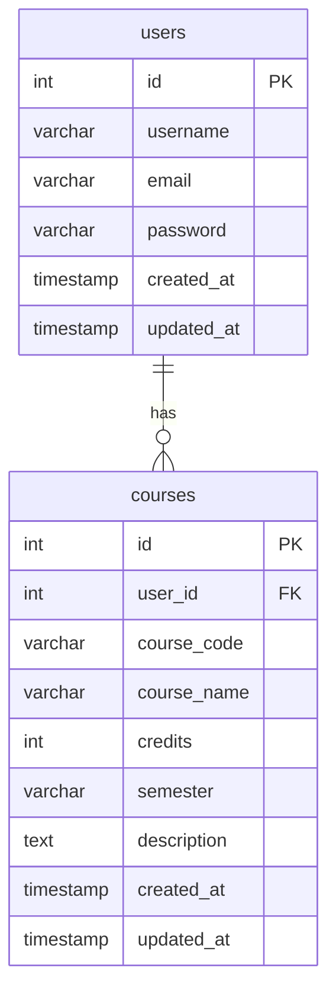

# Course List API

This is a RESTful API for managing course lists with user authentication.

## Features

- User authentication (register, login, update, delete)
- Course list management
- Secure password storage
- JWT token authentication

## Setup

1. Install dependencies:
```bash
npm install
```

2. Create a `.env` file with the following variables:
```
DB_HOST=localhost
DB_PORT=3310
DB_USER=root
DB_PASSWORD=
DB_NAME=course_list_db
JWT_SECRET=your_jwt_secret
```

3. Run the SQL script to create the database:
```bash
mysql -u root < database/schema.sql
```

4. Start the server:
```bash
npm run dev
```

## Postman Setup

1. Import the provided files in `postman` folder:
   - `rest-api-express.postman_collection.json`
   - `rest-api-express.postman_environment.json`

2. Select the imported environment in the top-right dropdown in the collection.

## API Endpoints

### Users

#### Register - `POST /api/users/register`
Request body:
```json
{
    "username": "john_doe",
    "email": "john@example.com",
    "password": "password123"
}
```
Response (201):
```json
{
    "message": "User created successfully"
}
```

#### Login - `POST /api/users/login`
Request body:
```json
{
    "email": "john@example.com",
    "password": "password123"
}
```
Response (200):
```json
{
    "token": "eyJhbGciOiJIUzI1NiIsInR5..."
}
```

#### Update Profile - `PUT /api/users/me`
Headers:
```
Authorization: Bearer your_jwt_token
```
Request body:
```json
{
    "username": "john_doe_updated",
    "email": "john_new@example.com"
}
```
Response (200):
```json
{
    "message": "Account updated successfully"
}
```

#### Delete Account - `DELETE /api/users/me`
Headers:
```
Authorization: Bearer your_jwt_token
```
Response (200):
```json
{
    "message": "Account deleted successfully"
}
```

### Courses

#### Get All Courses - `GET /api/courses`
Headers:
```
Authorization: Bearer your_jwt_token
```
Response (200):
```json
[
    {
        "id": 1,
        "course_code": "CS101",
        "course_name": "Introduction to Programming",
        "credits": 3,
        "semester": "Fall 2024",
        "description": "Learn programming fundamentals",
        "created_at": "2024-01-19T10:00:00.000Z",
        "updated_at": "2024-01-19T10:00:00.000Z"
    }
]
```

#### Get Course Details - `GET /api/courses/:id`
Headers:
```
Authorization: Bearer your_jwt_token
```
Response (200):
```json
{
    "id": 1,
    "course_code": "CS101",
    "course_name": "Introduction to Programming",
    "credits": 3,
    "semester": "Fall 2024",
    "description": "Learn programming fundamentals",
    "created_at": "2024-01-19T10:00:00.000Z",
    "updated_at": "2024-01-19T10:00:00.000Z"
}
```

#### Add New Course - `POST /api/courses/add-course`
Headers:
```
Authorization: Bearer your_jwt_token
```
Request body:
```json
{
    "courses": [
        {
            "course_code": "CS101",
            "course_name": "Introduction to Programming",
            "credits": 3,
            "semester": "Fall 2024",
            "description": "Learn programming fundamentals"
        },
        {
            "course_code": "CS102",
            "course_name": "Data Structures",
            "credits": 4,
            "semester": "Spring 2025",
            "description": "Understanding fundamental data structures and algorithms"
        },
        {
            "course_code": "CS103",
            "course_name": "Database Systems",
            "credits": 3,
            "semester": "Fall 2025",
            "description": "Introduction to database design and SQL"
        }
    ]
}
```
Response (201):
```json
{
    "message": "Successfully created 3 courses",
    "courses": [
        {
            "id": 1,
            "course_code": "CS101",
            "course_name": "Introduction to Programming",
            "credits": 3,
            "semester": "Fall 2024",
            "description": "Learn programming fundamentals",
            "created_at": "2024-01-19T10:00:00.000Z",
            "updated_at": "2024-01-19T10:00:00.000Z"
        },
        {
            "id": 2,
            "course_code": "CS102",
            "course_name": "Data Structures",
            "credits": 4,
            "semester": "Spring 2025",
            "description": "Understanding fundamental data structures and algorithms",
            "created_at": "2024-01-19T10:00:00.000Z",
            "updated_at": "2024-01-19T10:00:00.000Z"
        },
        {
            "id": 3,
            "course_code": "CS103",
            "course_name": "Database Systems",
            "credits": 3,
            "semester": "Fall 2025",
            "description": "Introduction to database design and SQL",
            "created_at": "2024-01-19T10:00:00.000Z",
            "updated_at": "2024-01-19T10:00:00.000Z"
        }
    ]
}
```

#### Update Course - `PUT /api/courses/update-course/:id`
Headers:
```
Authorization: Bearer your_jwt_token
```
Request body:
```json
{
    "course_name": "Advanced Programming",
    "credits": 4
}
```
Response (200):
```json
{
    "id": 1,
    "course_code": "CS101",
    "course_name": "Advanced Programming",
    "credits": 4,
    "semester": "Fall 2024",
    "description": "Learn programming fundamentals",
    "created_at": "2024-01-19T10:00:00.000Z",
    "updated_at": "2024-01-19T10:00:00.000Z"
}
```

#### Delete Course - `DELETE /api/courses/:id`
Headers:
```
Authorization: Bearer your_jwt_token
```
Response (200):
```json
{
    "message": "Course deleted successfully"
}
```

## Technologies Used

- Node.js
- Express.js
- MySQL
- JWT for authentication
- bcryptjs for password hashing

## Database Schema


